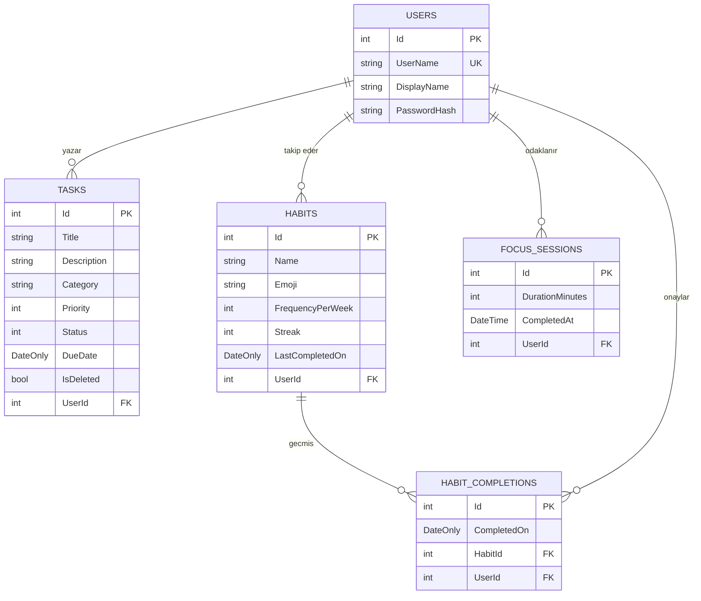
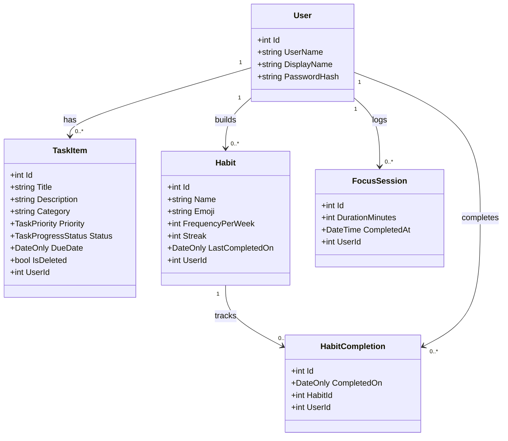

# PROJE RAPORU
## Üretkenlik ve Alışkanlık Takip Uygulaması (ProductivityApp)

---

## 1. GRUP BİLGİLERİ VE CV'LER (DOLDURULACAK ALANLAR)

### Grup Üyeleri Tablosu
| Adı Soyadı | Öğrenci Numarası | E-Posta | Projedeki Rolü |
| :--- | :--- | :--- | :--- |
| [Buraya Ad Soyad Yazın] | [Numara] | [E-Posta] | [Rolü] |
| [Buraya Ad Soyad Yazın] | [Numara] | [E-Posta] | [Rolü] |
| [Buraya Ad Soyad Yazın] | [Numara] | [E-Posta] | [Rolü] |
| [Buraya Ad Soyad Yazın] | [Numara] | [E-Posta] | [Rolü] |

---

### FOTOĞRAFLI CV ALANLARI

#### 1. Üye CV
*   **Fotoğraf:** [Buraya Fotoğrafınızı Sürükleyin / Yerleştirin]
*   **Adı Soyadı:** [Ad Soyad]
*   **Öğrenim Durumu:** [Bölüm / Sınıf]
*   **Yetenekler:** [Örn: C#, HTML, CSS, SQL]
*   **Kişisel Özet:** [Kısa özgeçmişiniz]

#### 2. Üye CV
*   **Fotoğraf:** [Buraya Fotoğrafınızı Sürükleyin / Yerleştirin]
*   **Adı Soyadı:** [Ad Soyad]
*   **Öğrenim Durumu:** [Bölüm / Sınıf]
*   **Yetenekler:** [Örn: C#, HTML, CSS, SQL]
*   **Kişisel Özet:** [Kısa özgeçmişiniz]

#### 3. Üye CV
*   **Fotoğraf:** [Buraya Fotoğrafınızı Sürükleyin / Yerleştirin]
*   **Adı Soyadı:** [Ad Soyad]
*   **Öğrenim Durumu:** [Bölüm / Sınıf]
*   **Yetenekler:** [Örn: C#, HTML, CSS, SQL]
*   **Kişisel Özet:** [Kısa özgeçmişiniz]

#### 4. Üye CV
*   **Fotoğraf:** [Buraya Fotoğrafınızı Sürükleyin / Yerleştirin]
*   **Adı Soyadı:** [Ad Soyad]
*   **Öğrenim Durumu:** [Bölüm / Sınıf]
*   **Yetenekler:** [Örn: C#, HTML, CSS, SQL]
*   **Kişisel Özet:** [Kısa özgeçmişiniz]

---

## 2. PROJE TANITIMI (İÇERİK)

Bu proje; kişisel zaman yönetimi, görev takibi ve alışkanlık sürdürülebilirliğini sağlamak amacıyla geliştirilmiş web tabanlı bir **üretkenlik portalıdır**. Sistem, kullanıcıların işlerini organize etmesini, alışkanlıklarını görselleştirmesini ve Pomodoro süreleriyle odaklanmasını hedefler.

### Kullanılan Teknolojiler
*   **Backend / İş Mantığı:** ASP.NET Core 8.0 Razor Pages (C#)
*   **Veritabanı Katmanı:** SQLite & Entity Framework Core (ORM)
*   **Güvenlik:** PBKDF2 Şifre Hashing Servisi
*   **Frontend (Arayüz):** HTML5, CSS3 (Glassmorphism Stil) ve JavaScript (DOM manipülasyonu & AJAX)
*   **Grafikler:** Chart.js kütüphanesi

---

## 3. VERİTABANI İLİŞKİLERİ

Uygulamanın veritabanı şeması ilişkisel kurallara uygun olarak tasarlanmıştır. `AppDbContext` sınıfı üzerinden yönetilen ilişkiler ve tablolar şu şekildedir:

### Tablolar ve Alanları
1.  **User (Kullanıcı):** Kullanıcı adı, ekran adı ve hash'lenmiş şifreyi barındırır.
2.  **TaskItem (Görev):** Görevin başlığı, açıklaması, kategorisi, öncelik derecesi (Düşük, Normal, Yüksek), ilerleme durumu (Bekliyor, Devam Ediyor, Tamamlandı) ve son teslim tarihini tutar.
3.  **Habit (Alışkanlık):** Rutin adı, emoji simgesi, haftalık yapılması hedeflenen gün sayısı ve güncel tamamlama serisi (Streak) verilerini saklar.
4.  **HabitCompletion (Alışkanlık Geçmişi):** Alışkanlıkların hangi tarihlerde tamamlandığının kaydını tutarak ısı haritasını besler.
5.  **FocusSession (Odaklanma Seansı):** Pomodoro oturum sürelerini ve bitiş zamanlarını kaydeder.

### ER (Entity-Relationship) Diyagramı



---

## 4. KULLANICI ARAYÜZLERİNİN DETAYLI ANLATIMI

Uygulamadaki her bir modülün arayüzü ve arkasındaki işlevler şu şekildedir:

### 1. Giriş ve Kayıt Arayüzleri
*   Kullanıcıların sisteme güvenli şekilde oturum açmasını sağlar. Oturum doğrulaması sunucu tarafında HTTP Session mekanizması ile gerçekleştirilir.

### 2. Panel (Dashboard / Ana Ekran)
*   Kullanıcıya özel hatırlatma kartlarını listeler. Teslim tarihi 1 gün kalan görevler sarı etiketle, bugün yapılması gereken ama henüz işaretlenmemiş alışkanlıklar ise kırmızı etiketle dinamik olarak gösterilir.

### 3. Görev Yönetim Sayfası (Tasks)
*   Yeni görev ekleme formu bulunur.
*   **Asenkron AJAX Güncellemesi:** Tablo üzerindeki görev durumları veya öncelikleri tıklandığında sayfa yenilenmeden arka planda veritabanına kaydedilir.
*   **Geri Alma (Undo) Desteği:** Görev silindiğinde bellek içi bir Stack yapısı tetiklenir ve kullanıcının silme işlemini tek tıkla geri almasını sağlar.

### 4. Alışkanlık Takip Sayfası (Habits)
*   Kullanıcının emoji seçerek alışkanlık kartı eklediği alandır. Günlük tamamlama butonuna basıldığında seri (streak) algoritması tetiklenir.

### 5. Pomodoro Odaklanma Sayfası (Focus)
*   JavaScript tabanlı dairesel geri sayım sayacıdır. 25 dakikalık çalışma bittiğinde sunucuya istek göndererek seansı kaydeder.

### 6. İstatistik Rapor Sayfası (Stats)
*   Chart.js entegrasyonuyla haftalık odaklanma sürelerinin bar grafiğini çizer.
*   Son 30 günde alışkanlıkların kaç kere yapıldığını renk yoğunluğuna göre görselleştiren bir **Isı Haritası (Heatmap)** sunar.

---

## 5. USE-CASE DİYAGRAMI VE METRİK SENARYOLARI

### Use-Case Şematik Yapısı

```
                     +---------------------------------------+
                     |         ProductivityApp Sistemi       |
                     |                                       |
                     |             +-----------+             |
                     |             | Kayit Ol  |             |
                     |             +-----+-----+             |
                     |                   |                   |
                     |             +-----+-----+             |
                     |             | Giris Yap |             |
                     |             +-----+-----+             |
                     |                   |                   |
    ((Kullanici)) ---+-------------------+-------------------|
                     |                   |                   |
                     |             +-----+-----+             |
                     |             | Gorevleri |             |
                     |             |  Yonet    |             |
                     |             +-----+-----+             |
                     |                   |                   |
                     |             +-----+-----+             |
                     |             | Aliskanlik|             |
                     |             | Takip Et  |             |
                     |             +-----+-----+             |
                     |                   |                   |
                     |             +-----+-----+             |
                     |             | Pomodoro  |             |
                     |             |  Calistir |             |
                     |             +-----------+             |
                     |                                       |
                     +---------------------------------------+
```

### Use-Case Senaryoları Tablosu

| Use-Case Adı | Aktör | Ön Koşul | Açıklama |
| :--- | :--- | :--- | :--- |
| Oturum Açma | Kullanıcı | Kayıtlı Üyelik | Kullanıcı şifre doğrulamasından geçerek sisteme giriş yapar. |
| Görev Yönetimi | Kullanıcı | Oturum Açılmış Olmalı | Görev ekler, düzenler veya soft-delete (geri alınabilir silme) yapar. |
| Alışkanlık Takibi | Kullanıcı | Oturum Açılmış Olmalı | Alışkanlık oluşturur ve günlük tamamlama işaretlemesi yapar. |
| Odaklanma Oturumu | Kullanıcı | Oturum Açılmış Olmalı | Sayaç bittiğinde veritabanına otomatik odak süresi yazılır. |

---

## 6. CLASS DİYAGRAMI (DOMAIN MODEL)

Aşağıdaki sınıf diyagramı, projedeki C# model sınıflarının yapısını, özelliklerini ve birbiriyle olan bağlantılarını göstermektedir:


