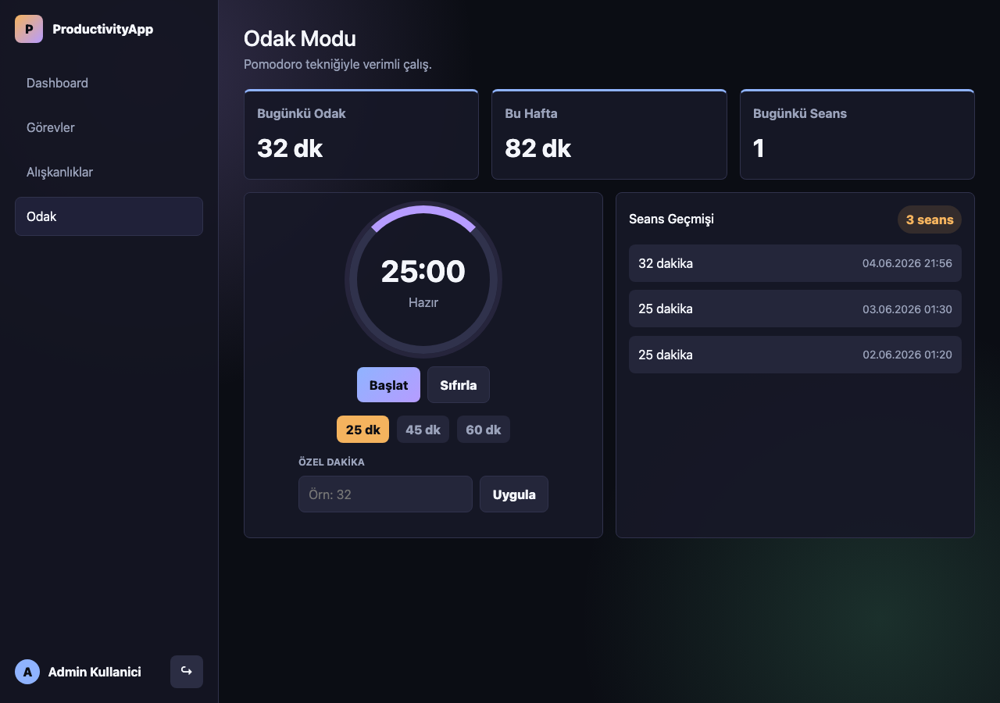

# ProductivityApp

ASP.NET Core Razor Pages ile hazırlanmış kişisel verimlilik ve odak takip uygulaması.

## Çalıştırma

Bilgisayarda .NET 8 SDK kurulu olmalıdır.

```bash
cd ProductivityApp
dotnet restore
dotnet build
dotnet run
```

Uygulama çalışınca aşağıdaki adresten açılır:

```text
http://127.0.0.1:5080
```

Demo kullanıcı:

```text
Kullanıcı adı: admin
Şifre: admin123
```

Veritabanı ilk çalıştırmada otomatik olarak `app.db` dosyasıyla oluşur.

## Ekran Görüntüsü


